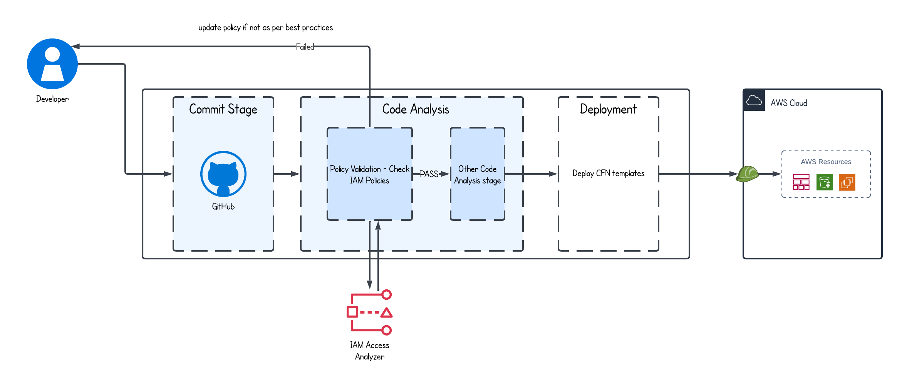

# AWS-IAM-Policy-Validation-Automation
This repository demonstrates how to integrate **IAM policy validation** into your **CI/CD pipeline** using **GitHub Actions** and **AWS IAM Access Analyzer**.

## 🖼️ CI/CD Design Overview

## ✅ Prerequisites

- An AWS account with **IAM Access Analyzer enabled**
- A GitHub repo with **OIDC role integration**
- Reference policies defined for validation.